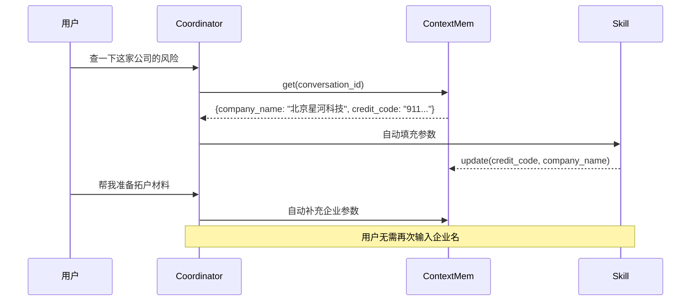

# 02 - 系统架构

## 2.1 整体架构

系统采用**前后端分离**架构，前端为 React SPA，后端为 FastAPI 异步服务，两者通过 HTTP + SSE（Server-Sent Events）通信。后端集成了 AgentScope 多智能体框架和 DeepSeek LLM API 实现智能对话和业务处理。

```mermaid
graph TB
    User([客户经理]) --> Browser[前端 React SPA]
    Browser --> ViteProxy[Vite Dev Proxy<br/>/api → localhost:8000]
    ViteProxy --> Backend[FastAPI Backend<br/>main.py]

    subgraph Backend["后端服务 (FastAPI)"]
        Auth[认证模块<br/>auth.py] --> JWT[JWT Token]
        Router[API 路由层<br/>main.py]
        Router --> StreamAPI[/api/chat/stream<br/>SSE Streaming]
        Router --> RESTAPI[其他 REST API]
        StreamAPI --> Coordinator[Coordinator<br/>coordinator.py]
        Coordinator -->|skill| SkillRegistry[Skill Registry<br/>skills/__init__.py]
        Coordinator -->|chat| Agent[AgentScope Agent<br/>agent_config.py]
        SkillRegistry --> RiskCheck[check_company_risk]
        SkillRegistry --> Outreach[prepare_customer_outreach]
        SkillRegistry --> ProductRec[recommend_products]
        SkillRegistry --> ProductMatch[match_products_intelligently]
        SkillRegistry --> PotentialCust[recommend_corporate_customers]
        SkillRegistry --> AccountOpen[open_corporate_account]
        StreamAPI --> FollowUp[Follow-Up Agent<br/>follow_up_agent.py]
        SkillRegistry --> ContextMem[Context Memory<br/>context_memory.py]
    end

    subgraph LLM["LLM 服务 (DeepSeek API)"]
        DS_Chat[deepseek-chat<br/>意图识别 / 追问 / 匹配]
        DS_FLASH[deepseek-v4-flash<br/>Agent 对话]
    end

    Coordinator --> DS_Chat
    Agent --> DS_FLASH
    FollowUp --> DS_Chat
    ProductMatch --> DS_Chat

    subgraph Storage["数据存储 (JSON 文件)"]
        Users[users.json<br/>用户数据]
        Risk[risk_check.json<br/>风险数据]
        OutreachData[customer_outreach.json<br/>拓户资料]
        Products[product_recommendations.json<br/>产品货架]
        Potential[potential_customers.json<br/>潜客来源]
        Details[potential_customer_details.json<br/>潜客明细]
        Upload[uploaded_customers.json<br/>用户上传]
        NameIndex[company_name_index.json<br/>企业名称索引]
        Account[account_opening.json<br/>开户申请]
        Workflow[follow_up_workflows.md<br/>追问流程]
    end

    RiskCheck --> Risk
    RiskCheck --> NameIndex
    Outreach --> OutreachData
    Outreach --> NameIndex
    ProductRec --> Products
    ProductRec --> NameIndex
    ProductMatch --> Products
    PotentialCust --> Potential
    PotentialCust --> Details
    PotentialCust --> Upload
    AccountOpen --> Account
    AccountOpen --> NameIndex
    FollowUp --> Workflow

    subgraph H5["H5 静态页面 (static/h5/)"]
        RiskH5[risk-report.html]
        InsightsH5[marketing-insights.html]
        ScriptH5[marketing-script.html]
        ProdRecH5[product-recommend.html]
        UploadH5[account-upload.html]
        PreviewH5[account-preview.html]
        SubmittedH5[account-submitted.html]
    end

    RESTAPI --> RiskH5
    RESTAPI --> InsightsH5
    RESTAPI --> ScriptH5
    RESTAPI --> ProdRecH5
    RESTAPI --> UploadH5
    RESTAPI --> PreviewH5
    RESTAPI --> SubmittedH5
```

## 2.2 前后端关系

| 通信方式 | 路径 | 说明 |
|----------|------|------|
| HTTP REST | `/api/auth/*` | 注册、登录 |
| HTTP REST | `/api/conversations/*` | 会话 CRUD |
| HTTP REST | `/api/customer-template` | 下载 Excel 模板 |
| HTTP REST | `/api/customer-upload` | 上传客户清单 |
| HTTP REST | `/api/risk-report/{code}` | H5 风险报告数据 |
| HTTP REST | `/api/outreach/{code}` | H5 拓户材料数据 |
| HTTP REST | `/api/product-recommend/{code}` | H5 产品推荐数据 |
| HTTP REST | `/api/account-opening/*` | 开户流程 API |
| SSE（Stream） | `/api/chat/stream` | 流式聊天 |

前端通过 Vite 开发服务器代理 `/api` 请求到后端，生产构建时需使用 Nginx 或其他反向代理。

## 2.3 服务和组件职责

### 2.3.1 智能体层

| 组件 | 文件 | 职责 |
|------|------|------|
| Agent | `main.py:get_agent()` | AgentScope Agent 实例，处理非技能类对话 |
| Coordinator | `coordinator.py:route_intent()` | LLM 意图识别，决策路由到 skill 或 chat |
| Context Memory | `context_memory.py:ContextMemory` | 线程安全的会话上下文（企业主体跟踪） |
| Follow-Up Agent | `follow_up_agent.py:predict_follow_up()` | 预测下一步追问建议 |
| Skill Registry | `skills/__init__.py:SkillRegistry` | 技能注册、发现、调用 |

### 2.3.2 技能层（6 个）

| 技能名 | 注册文件 | 触发条件 |
|--------|----------|----------|
| `recommend_corporate_customers` | `skills/potential_customer.py` | 拓户、潜客、客户清单、上传等关键词 |
| `check_company_risk` | `skills/risk_check.py` | 查询风险、风险预查、风险筛查等关键词 |
| `prepare_customer_outreach` | `skills/customer_outreach.py` | 拓户材料、营销材料、拓户准备等关键词 |
| `recommend_products` | `skills/product_recommend.py` | 推荐产品、产品智荐、适合什么产品等关键词 |
| `match_products_intelligently` | `skills/product_match.py` | 描述具体资金需求场景（含金额数字） |
| `open_corporate_account` | `skills/account_opening.py` | 办理开户、协助开户、准备开户资料等关键词 |

### 2.3.3 API 层

所有 API 路由定义在 `main.py` 中，按功能分组：

- 认证接口（`/api/auth/*`）
- 健康检查（`/api/health`）
- 会话管理（`/api/conversations/*`）
- 聊天接口（`/api/chat/stream`）
- 风险报告（`/api/risk-report/{code}`）
- 拓户材料（`/api/outreach/{code}`）
- 产品推荐（`/api/product-recommend/{code}`）
- 客户清单上传（`/api/customer-template`, `/api/customer-upload`）
- 对公账户开户（`/api/account-opening/*`）

## 2.4 外部系统

| 外部系统 | 用途 | 访问方式 |
|----------|------|----------|
| DeepSeek API | LLM 模型调用 | HTTPS REST API，需 API Key |
| 浏览器 | H5 页面渲染 | 客户经理浏览器直接访问 |

## 2.5 核心架构模式

### 2.5.1 Intent → Skill 路由模式

```
用户输入 → Coordinator (LLM) → {"action": "skill", "skill": "...", "params": {...}}
                              → {"action": "chat"} → AgentScope Agent 对话
```

### 2.5.2 SSE 流式响应模式

前端发送 POST `/api/chat/stream` → 后端返回 `StreamingResponse`（SSE），事件类型包括：

| 事件类型 | 说明 |
|----------|------|
| `meta` | 会话元数据（conversation_id） |
| `text_start/delta/done` | 普通文本流式输出 |
| `potential_customer_summary/detail` | 潜客卡片数据 |
| `risk_check_result` | 风险预查结果 |
| `outreach_result` | 拓户准备结果 |
| `product_recommend_result` | 产品智荐结果 |
| `product_match_result` | 产品智能匹配结果 |
| `account_opening_result` | 对公账户开户结果 |
| `follow_up_suggestion` | 追问建议 |
| `done` | 流结束 |
| `error` | 错误信息 |

### 2.5.3 上下文记忆模式


