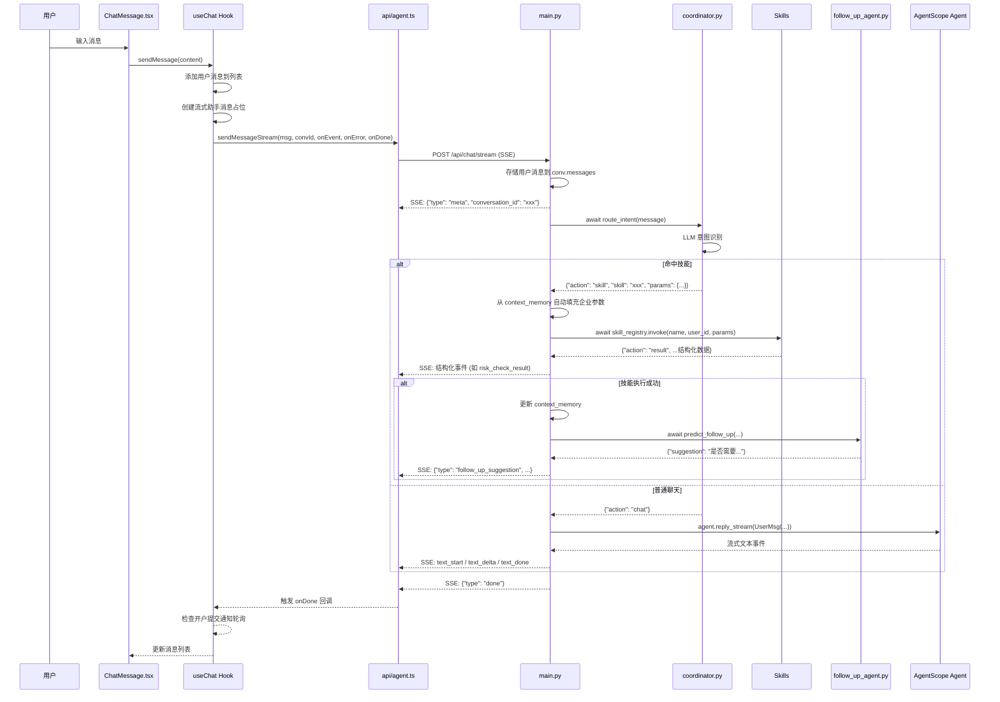
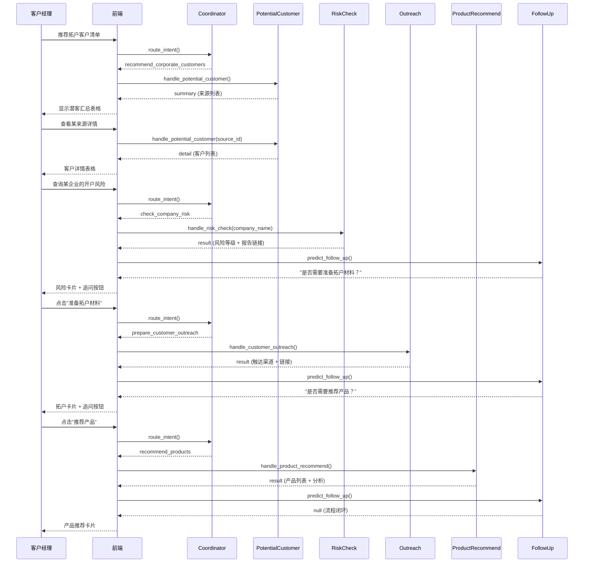
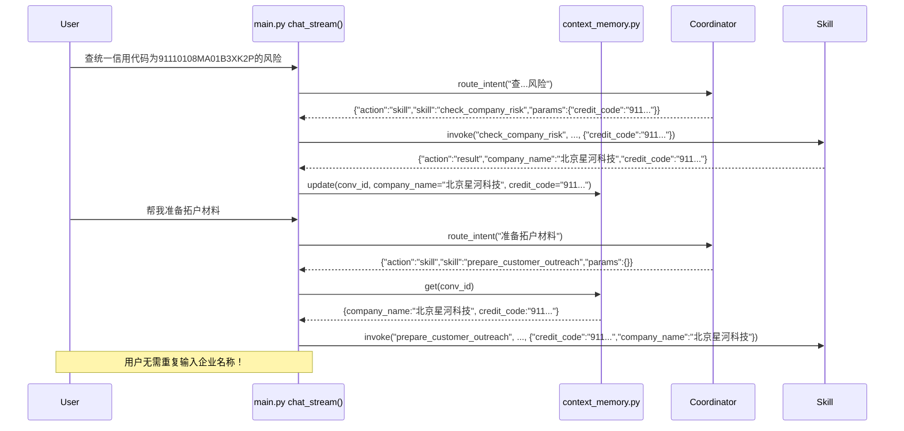

# 03 - 业务流程与完整调用链

## 3.1 全局聊天流程



## 3.2 业务流程 A：潜客识别 → 风险预查 → 拓户准备 → 产品推荐

这是最完整的业务流程链路。

### 3.2.1 完整调用链

```
[前端] ChatContainer (快捷问题 / 用户输入)
  → [前端] ChatInput.handleSend()
  → [前端] useChat.sendMessage("推荐拓户客户清单")
  → [前端] api/agent.ts sendMessageStream()
  → [后端] POST /api/chat/stream
    body: { "message": "推荐拓户客户清单" }
  → [后端] main.py chat_stream()
  → [后端] coordinator.py route_intent()
    → [LLM] 意图识别 → {"action": "skill", "skill": "recommend_corporate_customers", "params": {}}
  → [后端] skills/potential_customer.py handle_potential_customer()
    → 读取 potential_customers.json（按 user_id）
    → 读取 uploaded_customers.json（按 user_id，合并来源）
    → 返回 {"action": "summary", "sources": [...]}
  → [后端] SSE: {"type": "potential_customer_summary", "data": {...}}
  → [前端] useChat 处理 potential_customer_summary 事件
  → [前端] ChatMessage 渲染 PotentialCustomerCard（汇总表格）

[用户点击"查看"某来源]
  → onRequestDetail(source_id, source_name)
  → onSendMessage("查看{source_name}的客户详情")
  → 同上流程路由到 recommend_corporate_customers，带 params: {"source_id": "corp_deposit_agent"}
  → skills/potential_customer.py → 读取 potential_customer_details.json
  → 返回 {"action": "detail", "customers": [...]}
  → 前端渲染 PotentialCustomerCard（详情表格）

[用户选择某企业]
  → 用户输入："查询北京星河科技有限公司是否存在开户风险"
  → Coordinator 路由到 check_company_risk，params: {"company_name": "北京星河科技有限公司"}
  → skills/risk_check.py handle_risk_check()
    → 加载 company_name_index.json 进行模糊匹配
    → 找到匹配后，加载 risk_check.json 获取风险详情
    → 返回 {"action": "result", "credit_code": "...", "risk_level": "high", "h5_url": "..."}
  → 前端渲染 RiskCheckCard（风险等级 + 结论 + H5 链接）
  → follow_up_agent.py 预测下一步 → "是否需要为「北京星河科技」准备拓户营销材料？"
  → 前端渲染 FollowUpChip

[用户点击追问/输入"准备拓户材料"]
  → Coordinator 路由到 prepare_customer_outreach
  → skills/customer_outreach.py handle_customer_outreach()
    → 加载 customer_outreach.json
    → 返回触达渠道、营销谈资 H5 链接、营销话术 H5 链接
  → 前端渲染 OutreachCard

[用户点击追问/输入"推荐产品"]
  → Coordinator 路由到 recommend_products
  → skills/product_recommend.py handle_product_recommend()
    → 加载 product_recommendations.json
    → 按优先级排序返回产品列表
  → 前端渲染 ProductRecommendCard
  → 流程闭环
```

### 3.2.2 时序图



## 3.3 业务流程 B：产品智能匹配

### 3.3.1 触发条件

用户输入中包含**具体金额数字 + 资金场景描述**（如"5千万工程款闲置一个月"），Coordinator 识别为 `match_products_intelligently` 技能。

### 3.3.2 完整调用链

```
[前端] 用户输入："客户最近有一笔5千万的工程款打入，会停留一个月后，需要抽出4千万购买原材料，请推荐收益最高的产品"
  → Coordinator 识别为 match_products_intelligently
    params: {"query": "客户最近有...收益最高的产品"}
  → skills/product_match.py handle_product_match()
    → 步骤1: 规则引擎 _extract_needs(query)
      → 提取金额: 5000万, 4000万
      → 提取期限: 30天
      → 提取风险偏好: medium（默认）
      → 提取流动性: medium（含"停留"关键词）
      → 判断资金方向: both（有入账+有支出）
    → 步骤2: 按资金方向预筛选产品货架
    → 步骤3: 加载企业画像（如有）
    → 步骤4: LLM 智能匹配
      → 构建提示词（含结构化需求 + 产品货架 + 企业画像）
      → 调用 DeepSeek API
      → 解析返回的 JSON 匹配结果
    → 步骤5: 组装标准化返回值
    → 返回 {"action": "result", "needs_summary": "...", "matches": [...]}
  → 前端渲染 ProductMatchCard
```

### 3.3.3 规则引擎提取示例

| 输入 | 提取结果 |
|------|----------|
| "5千万工程款" | total_amount=5000万 |
| "抽出4千万购买原材料" | available_amount=4000万, purpose="购买原材料" |
| "停留一个月" | duration_days=30 |
| "收益最高" | return_priority=true |
| 「保本」「稳健」等关键词 | risk_preference=low |

### 3.3.4 资金方向判断

| 关键词 | 方向 |
|--------|------|
| 入账、到账、闲置、理财、存款 | investment（投资理财） |
| 贷款、借款、融资、资金缺口 | borrowing（融资借款） |
| 两者都有 | both（不筛选） |

## 3.4 业务流程 C：对公账户开户

### 3.4.1 状态机

```
[初始] → upload（等待上传资料）→ processing（资料上传完毕，等待 OCR）
       → preview（OCR 完成，等待预览确认）→ submitted（已提交，锁定）
```

### 3.4.2 完整调用链

```
[前端] 用户输入："客户已同意办理开户，请协助办理"
  → Coordinator 路由到 open_corporate_account
  → skills/account_opening.py handle_account_opening()
    → 解析企业名称 → 查找信用代码
    → 创建开户申请记录 → 写入 account_opening.json
    → 返回 {"action": "result", "status": "upload", "upload_url": "..."}
  → 前端渲染 AccountOpeningCard（upload 状态），显示"上传资料"按钮

[H5 页面 account-upload.html]
  → 客户经理上传营业执照 + 法人身份证图片
  → POST /api/account-opening/upload → 状态变为 processing
  → POST /api/account-opening/process/{app_id}
    → 调用 skills/account_opening.py _mock_ocr_and_prefill()
    → Mock 数据预填四大模块（企业信息、账户信息、尽职调查、产品签约）
    → 状态变为 preview
    → 返回 preview_url → 跳转到 account-preview.html

[H5 页面 account-preview.html]
  → GET /api/account-opening/preview/{app_id} → 加载预填数据
  → 客户经理在 H5 页面微调各字段
  → PUT /api/account-opening/update/{app_id} → 保存修改
  → 点击"确认提交" → POST /api/account-opening/submit/{app_id}
    → 状态变为 submitted
    → POST /api/account-opening/notify/{app_id} → 通知入队
    → 跳转到 account-submitted.html

[前端轮询]
  → useChat 每 5 秒调用 /api/account-opening/notifications/{conv_id}
  → 获取提交通知 → 自动追加开户成功消息到聊天列表
```

### 3.4.3 预填数据来源

| 预填模块 | 数据来源 |
|----------|----------|
| 企业名称/信用代码 | risk_check.json / customer_outreach.json / product_recommendations.json |
| 注册地址 | customer_outreach.json business_address |
| 风险评级 | risk_check.json risk_level |
| 行业分析 | product_recommendations.json analysis_summary |
| 法人/受益人 | Mock 生成（基于信用代码哈希） |
| 账号 | Mock 生成（随机 16 位数字） |

## 3.5 业务流程 D：客户清单上传

### 3.5.1 完整调用链

```
[前端] 用户点击"上传客户清单"
  → PotentialCustomerCard 显示 UploadModal
  → 用户点击"下载模板" → GET /api/customer-template → 返回 Excel 文件
  → 用户选择 .xlsx 文件，选择模式（覆盖/追加），点击"上传"
  → POST /api/customer-upload（multipart/form-data）
    → 后端解析 Excel（openpyxl）
    → 读取列：企业名称 / 统一社会信用代码 / 推荐得分
    → 按 mode 存储到 uploaded_customers.json（按 user_id 分组）
  → 返回成功信息
  → 上传成功后自动发消息"推荐拓户客户清单"刷新列表
```

### 3.5.2 参数校验

| 校验项 | 位置 | 逻辑 |
|--------|------|------|
| 文件类型 | 前端 + 后端 | 仅接受 .xlsx / .xls |
| 空数据 | 后端 | 跳过空行，无有效数据则报错 |
| 模式 | 后端 | overwrite=覆盖, append=按 credit_code 去重合并 |

## 3.6 上下文记忆机制



## 3.7 追问 Agent 逻辑

参考 `follow_up_workflows.md` 和 `follow_up_agent.py`，追问流程遵循以下规则：

| 当前已完成技能 | 允许追问方向 | 禁止追问方向 |
|----------------|-------------|-------------|
| check_company_risk | prepare_customer_outreach | recommend_products, check_company_risk |
| prepare_customer_outreach | recommend_products | check_company_risk, prepare_customer_outreach |
| recommend_products | prepare_customer_outreach（仅当拓户未做过） | recommend_products, check_company_risk |
| recommend_corporate_customers (summary) | 追问查看详情 | — |
| recommend_corporate_customers (detail) | check_company_risk | — |
| 三大核心全部完成 | 不追问（流程闭环） | 全部 |
