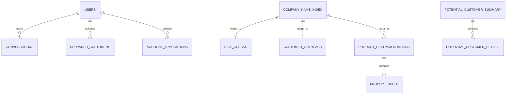

# 05 - 数据库设计

## 5.1 概述

本项目**不使用传统关系型数据库**，全部数据以 JSON 文件存储于 `backend/data/` 目录。



## 5.2 数据文件清单

| 文件 | 业务用途 | 读写代码 |
|------|----------|----------|
| `users.json` | 用户注册信息 | `auth.py:UserStore` |
| `potential_customers.json` | 潜客来源汇总 | `skills/potential_customer.py` |
| `potential_customer_details.json` | 潜客明细数据 | `skills/potential_customer.py` |
| `uploaded_customers.json` | 用户自定义上传客户 | `skills/potential_customer.py`, `main.py:681-766` |
| `risk_check.json` | 企业风险预查数据 | `skills/risk_check.py`, `main.py:520-537` |
| `company_name_index.json` | 企业名称 ↔ 信用代码映射 | `skills/risk_check.py`（所有技能共用） |
| `customer_outreach.json` | 拓户准备材料 | `skills/customer_outreach.py`, `main.py:543-560` |
| `product_recommendations.json` | 产品货架 + 企业推荐 | `skills/product_recommend.py`, `skills/product_match.py`, `main.py:566-607` |
| `account_opening.json` | 开户申请数据 | `skills/account_opening.py`, `main.py:777-981` |
| `follow_up_workflows.md` | 追问流程文档（LLM 提示用） | `follow_up_agent.py` |

---

## 5.3 users.json — 用户存储

**文件路径**: `backend/data/users.json`
**业务用途**: 存储注册用户信息（含密码哈希）

**数据结构**:
```json
{
  "<user_id (UUID)>": {
    "id": "string (UUID)",
    "username": "string (唯一)",
    "password": "string (salt$hash 格式)",
    "created_at": "string (ISO datetime)"
  }
}
```

**字段说明**:

| 字段 | 类型 | 允许空 | 默认值 | 说明 |
|------|------|--------|--------|------|
| id | string | 否 | UUID4 | 主键 |
| username | string | 否 | — | 唯一用户名 |
| password | string | 否 | — | salt$sha256(salt+password) |
| created_at | string | 否 | 当前时间 | 注册时间（ISO 格式） |

**读写代码**: `auth.py:UserStore`（`create_user()`, `authenticate()`, `get_user()`）

---

## 5.4 company_name_index.json — 企业名称索引

**文件路径**: `backend/data/company_name_index.json`
**业务用途**: 企业统一信用代码 ↔ 企业名称的双向映射，用于模糊匹配

**数据结构**（当前 23 条记录）:
```json
{
  "<credit_code>": "<company_name>"
}
```

**字段说明**:

| 字段 | 类型 | 说明 |
|------|------|------|
| key | string | 18 位统一信用代码 |
| value | string | 企业全称 |

**读写代码**:
- 读取: `skills/risk_check.py:_load_json()`（被所有技能模块复用）
- 模糊匹配: `skills/risk_check.py:_fuzzy_match_company()`（子序列匹配 + 多关键词 AND + 子串匹配）

---

## 5.5 risk_check.json — 风险预查数据

**文件路径**: `backend/data/risk_check.json`
**业务用途**: 存储各企业的开户风险评估结果

**数据结构**（按 credit_code 索引）:
```json
{
  "<credit_code>": {
    "credit_code": "string (18位)",
    "company_name": "string",
    "has_risk": true/false,
    "risk_level": "high | medium | low",
    "risk_summary": "string (风险总结文字)",
    "details": {
      "<module_key>": {
        "name": "string (模块名，如 工商信息)",
        "items": [
          {
            "name": "string (指标名)",
            "result": "string (正常 | 异常 | 关注 等)",
            "has_risk": true/false,
            "detail": "string (详情说明)"
          }
        ]
      }
    }
  }
}
```

**风险等级枚举值**:

| 值 | 含义 | 分值 | 开户建议 |
|----|------|------|----------|
| high | 高风险 | 78 | 建议暂缓受理 |
| medium | 中等风险 | 45 | 标准尽调后可受理 |
| low | 低风险 | 12 | 建议受理 |

**详情模块**（每个企业含 4 个模块）:
- business_info（工商信息）
- financial_info（财务信息）
- compliance_info（合规信息）
- operation_info（经营信息）

**读写代码**:
- 读取: `skills/risk_check.py:handle_risk_check()`, `skills/account_opening.py:_mock_ocr_and_prefill()`, `main.py:get_risk_report()`

---

## 5.6 potential_customers.json — 潜客来源汇总

**文件路径**: `backend/data/potential_customers.json`
**业务用途**: 按用户分组，存储可用的潜客来源列表

**数据结构**:
```json
{
  "<user_id>": {
    "sources": [
      {
        "source_id": "corp_deposit_agent",
        "source_name": "对公存款智能体",
        "customer_count": 12
      }
    ]
  }
}
```

**读写代码**: `skills/potential_customer.py:handle_potential_customer()`

---

## 5.7 potential_customer_details.json — 潜客明细数据

**文件路径**: `backend/data/potential_customer_details.json`
**业务用途**: 按用户 + 来源分组，存储每个来源下的客户列表

**数据结构**（当前 16 条企业记录）:
```json
{
  "<user_id>": {
    "sources": {
      "<source_id>": [
        {
          "name": "string (企业名称)",
          "credit_code": "string (统一信用代码)",
          "score": 98.75 (float, 推荐得分 0-100)
        }
      ]
    }
  }
}
```

**读写代码**: `skills/potential_customer.py:handle_potential_customer()`

---

## 5.8 uploaded_customers.json — 用户上传客户

**文件路径**: `backend/data/uploaded_customers.json`
**业务用途**: 用户通过 Excel 上传的自定义客户清单

**数据结构**:
```json
{
  "<user_id>": [
    {
      "name": "string",
      "credit_code": "string",
      "score": 0.0
    }
  ]
}
```

**读写代码**:
- 读取: `skills/potential_customer.py:_load_uploaded()`, `main.py:730-732`
- 写入: `main.py:755-756`

---

## 5.9 customer_outreach.json — 拓户准备材料

**文件路径**: `backend/data/customer_outreach.json`
**业务用途**: 存储各企业的触达渠道、营销谈资、营销话术

**数据结构**（按 credit_code 索引）:
```json
{
  "<credit_code>": {
    "credit_code": "string",
    "company_name": "string",
    "business_address": "string (经营地址)",
    "registered_address": "string (注册地址)",
    "contact_channels": [
      {
        "type": "string (渠道类型，如 关联客户)",
        "relation": "string (关系描述)",
        "contact_method": "string (联系方式)",
        "priority": "high | medium"
      }
    ],
    "insights": {
      "company_profile": "string (企业概况描述)",
      "recent_news": [
        {"date": "2026-01-10", "title": "新闻标题", "source": "来源"}
      ],
      "industry_analysis": "string (行业分析)"
    },
    "scripts": {
      "approach": "string (切入策略)",
      "talking_points": ["话术1", "话术2", "..."],
      "value_props": ["卖点1", "卖点2", "..."]
    }
  }
}
```

**读写代码**:
- 读取: `skills/customer_outreach.py:handle_customer_outreach()`, `skills/account_opening.py:_mock_ocr_and_prefill()`, `main.py:get_outreach_data()`

---

## 5.10 product_recommendations.json — 产品货架 + 企业推荐

**文件路径**: `backend/data/product_recommendations.json`
**业务用途**: 存储金融产品货架和各企业的产品推荐

**数据结构**:
```json
{
  "products": {
    "<product_key>": {
      "product_name": "科技贷",
      "category": "对公信贷 | 对公存款 | 现金管理 | 融资租赁 | 供应链金融 | 对公理财",
      "priority": "high | medium",
      "features": ["特点1", "特点2"],
      "application_period": "5-7个工作日",
      "target_profile": "适用企业描述",
      "match_keywords": ["科技", "高新技术", ...],
      "min_amount": 100,
      "max_amount": 5000,
      "min_term_days": 180,
      "max_term_days": 1825,
      "risk_level": "low | medium | high",
      "liquidity": "low | medium | high"
    }
  },
  "recommendations": {
    "<credit_code>": {
      "credit_code": "string",
      "company_name": "string",
      "analysis_summary": "string (分析摘要)",
      "recommendations": [
        {
          "key": "string (对应 products 中的 key)",
          "priority": "high | medium | low",
          "reason": "string (推荐理由)",
          "expected_amount": "string (预估额度)"
        }
      ]
    }
  }
}
```

**产品分类**:

| category | 类型 | 产品示例 |
|----------|------|----------|
| 对公信贷 | lending | 科技贷、政采贷、税银通 |
| 融资租赁 | lending | 设备融资租赁 |
| 供应链金融 | lending | 应收账款融资、票据贴现 |
| 对公存款 | investment | 结构性存款、协议存款 |
| 现金管理 | investment | 七天通知存款、活期智能增值 |
| 对公理财 | investment | 固收类理财、货币基金、纯债理财 |

**读写代码**:
- 产品货架读取: `skills/product_recommend.py`, `skills/product_match.py`, `main.py:get_product_recommend()`
- 预填引用: `skills/account_opening.py:_mock_ocr_and_prefill()`

---

## 5.11 account_opening.json — 开户申请

**文件路径**: `backend/data/account_opening.json`
**业务用途**: 存储对公账户开户申请的完整数据

**数据结构**:
```json
{
  "applications": {
    "<app_id (app-{uuid})>": {
      "id": "string",
      "user_id": "string",
      "conversation_id": "string",
      "company_name": "string",
      "credit_code": "string",
      "status": "upload | processing | preview | submitted",
      "documents": {
        "business_license": "string (文件路径)",
        "legal_rep_id": "string (文件路径)"
      },
      "form_data": {
        "company_info": { /* 企业信息模块 */ },
        "account_info": { /* 账户信息模块 */ },
        "due_diligence": { /* 尽职调查模块 */ },
        "product_signing": { /* 产品签约模块 */ }
      },
      "created_at": "string (ISO datetime)",
      "submitted_at": "string | null"
    }
  }
}
```

**状态枚举**:

| 状态 | 含义 | 允许操作 |
|------|------|----------|
| upload | 等待上传资料 | 上传图片 |
| processing | 资料上传完毕，处理中 | 触发 OCR |
| preview | 预填完成，等待确认 | 预览、编辑、提交 |
| submitted | 已提交，锁定 | 仅查看 |

**form_data 四模块**:

**1. company_info（企业信息）**:
| 字段 | 类型 | 说明 |
|------|------|------|
| company_name | string | 企业名称 |
| credit_code | string | 统一信用代码 |
| registered_address | string | 注册地址 |
| registered_capital | string | 注册资金 |
| business_scope | string | 经营范围 |
| legal_representative | string | 法人姓名 |
| legal_rep_id_number | string | 法人证件号 |
| legal_rep_phone | string | 法人手机号 |
| beneficiary_name | string | 受益人姓名 |
| beneficiary_id_number | string | 受益人证件号 |
| beneficiary_relationship | string | 受益人关系 |

**2. account_info（账户信息）**:
| 字段 | 类型 | 说明 |
|------|------|------|
| account_type | string | 基本户 / 一般户 / 专用户 |
| currency | string | 人民币 / 美元 / 港币 / 欧元 |
| account_number | string | 系统生成账号 |
| reserved_seal | string | 预留印鉴 |
| reconciliation_method | string | 对账方式 |

**3. due_diligence（尽职调查）**:
| 字段 | 类型 | 说明 |
|------|------|------|
| opening_purpose | string | 开户目的 |
| fund_source | string | 资金来源 |
| expected_transaction_volume | string | 预期年交易规模 |
| cross_border_involved | string | 是否涉及跨境交易 |
| risk_rating | string | 风险评级 |
| conclusion | string | 尽调结论 |

**4. product_signing（产品签约）**:
| 字段 | 类型 | 说明 |
|------|------|------|
| enterprise_online_banking | boolean | 企业网银 |
| bank_enterprise_reconciliation | boolean | 银企对账 |
| enterprise_mobile_banking | boolean | 企业手机银行 |
| corporate_settlement_card | boolean | 单位结算卡 |
| payroll_service | boolean | 代发工资 |
| sms_notification | boolean | 短信通知 |

**读写代码**:
- 写入: `skills/account_opening.py:handle_account_opening()`, `main.py:784-787,819-822,844-845,896,916-917`
- 读取: `main.py:777-781,858-862, etc.`
