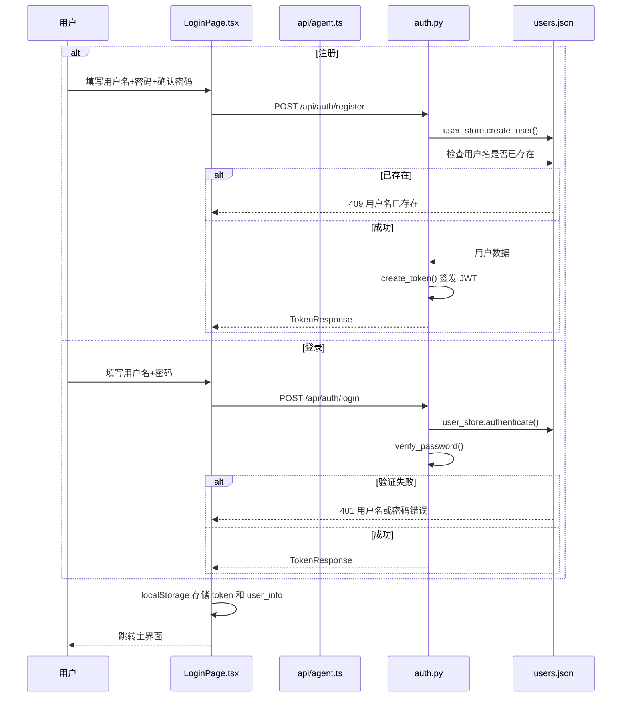

# 06 - 认证与权限

## 6.1 登录流程



## 6.2 Token 机制

### JWT 配置

| 参数 | 值 |
|------|-----|
| 算法 | HS256 |
| 密钥来源 | `JWT_SECRET` 环境变量（未设置则随机生成） |
| 有效期 | 24 小时 |
| 请求头格式 | `Authorization: Bearer <token>` |

### JWT Payload

```json
{
  "sub": "user_id (UUID)",
  "username": "string",
  "iat": "签发时间 (UTC)",
  "exp": "过期时间 (UTC)"
}
```

**签发**: `auth.py:create_token()`（第 79-87 行）
**验证**: `auth.py:decode_token()`（第 90-103 行），捕获 `ExpiredSignatureError` 和 `InvalidTokenError`

## 6.3 密码加密

### 加密方式

```
salt = secrets.token_hex(16)        # 随机 16 字节
hash = sha256(password + salt)
存储格式: "{salt}${hash}"
```

**位置**: `auth.py:hash_password()`（第 59-63 行）
**验证**: `auth.py:verify_password()`（第 66-73 行），使用 `secrets.compare_digest()` 防时序攻击

## 6.4 前端认证控制

### Token 存储

- `localStorage['auth_token']` — JWT Token
- `localStorage['user_info']` — JSON `{id, username}`

### 认证状态管理

```typescript
// App.tsx:22-28
const [user, setUser] = useState<UserData | null>(() => {
  const stored = localStorage.getItem('user_info');
  return stored ? JSON.parse(stored) : null;
});
const [token, setToken] = useState<string | null>(() =>
  localStorage.getItem('auth_token')
);
const isAuthenticated = !!token && !!user;
```

### 未登录处理

```tsx
// App.tsx:154-157
if (!isAuthenticated) {
  return <LoginPage onLoginSuccess={handleLoginSuccess} />;
}
```

### 退出登录

```typescript
// App.tsx:48-55
localStorage.removeItem('auth_token');
localStorage.removeItem('user_info');
setToken(null);
setUser(null);
setConversationId(null);
clearMessages();
```

### 认证头注入

所有需认证的 API 请求通过 `api/agent.ts:authHeaders()` 自动注入 `Authorization` 头：

```typescript
function authHeaders(): Record<string, string> {
  const headers: Record<string, string> = { 'Content-Type': 'application/json' };
  const token = getAuthToken();
  if (token) {
    headers['Authorization'] = `Bearer ${token}`;
  }
  return headers;
}
```

## 6.5 后端权限控制

### 依赖注入

使用 FastAPI 的 `Depends(get_current_user)` 实现路由级权限控制：

```python
# auth.py:179-196
async def get_current_user(
    credentials: HTTPAuthorizationCredentials = Depends(security_scheme),
) -> UserInfo:
    payload = decode_token(credentials.credentials)
    user_id = payload.get("sub")
    user = user_store.get_user(user_id)
    if not user:
        raise HTTPException(status_code=401, detail="用户不存在")
    return UserInfo(**user)
```

### 需要认证的路由

| 路由 | 鉴权方式 |
|------|----------|
| `GET /api/user/me` | `Depends(get_current_user)` |
| `GET /api/conversations` | `Depends(get_current_user)` |
| `POST /api/conversations` | `Depends(get_current_user)` |
| `GET /api/conversations/{id}` | `Depends(get_current_user)` |
| `DELETE /api/conversations/{id}` | `Depends(get_current_user)` |
| `POST /api/chat/stream` | `Depends(get_current_user)` |
| `GET /api/customer-template` | `Depends(get_current_user)` |
| `POST /api/customer-upload` | `Depends(get_current_user)` |

### 不需要认证的路由

| 路由 | 原因 |
|------|------|
| `POST /api/auth/register` | 注册 |
| `POST /api/auth/login` | 登录 |
| `GET /api/health` | 健康检查 |
| `GET /api/risk-report/{code}` | H5 页面数据（纯查询） |
| `GET /api/outreach/{code}` | H5 页面数据 |
| `GET /api/product-recommend/{code}` | H5 页面数据 |
| 所有 `/api/account-opening/*` | H5 页面调用（无强制认证） |

## 6.6 权限模型

系统采用**单一角色模型**——所有登录用户身份相同，功能完全一致，没有管理员/普通用户之分。权限控制仅做**身份认证**（Authentication），无**授权**（Authorization）分层。

### 数据隔离

- 会话按 `user_id` 隔离：`conversations[user_id][conv_id]`
- 上传客户按 `user_id` 隔离：`uploaded_customers.json[user_id]`
- 潜客数据按 `user_id` 隔离：`potential_customers.json[user_id]`
- 开户申请按 `app.user_id` 隔离
- 潜客详情（`potential_customer_details.json`）按 `user_id` 隔离

### 越权风险（待确认）

- 后端未校验访问其他用户的会话——`get_conversation()` 直接取 `_get_user_convs(current_user.id)`，基于当前用户 ID，不能越权访问其他用户
- 但 `uploaded_customers.json` 和其他 JSON 文件**没有用户级访问控制**——任何有 Token 的用户理论上可读取全部数据（当前仅按 user_id 键读取，实际可防护）
