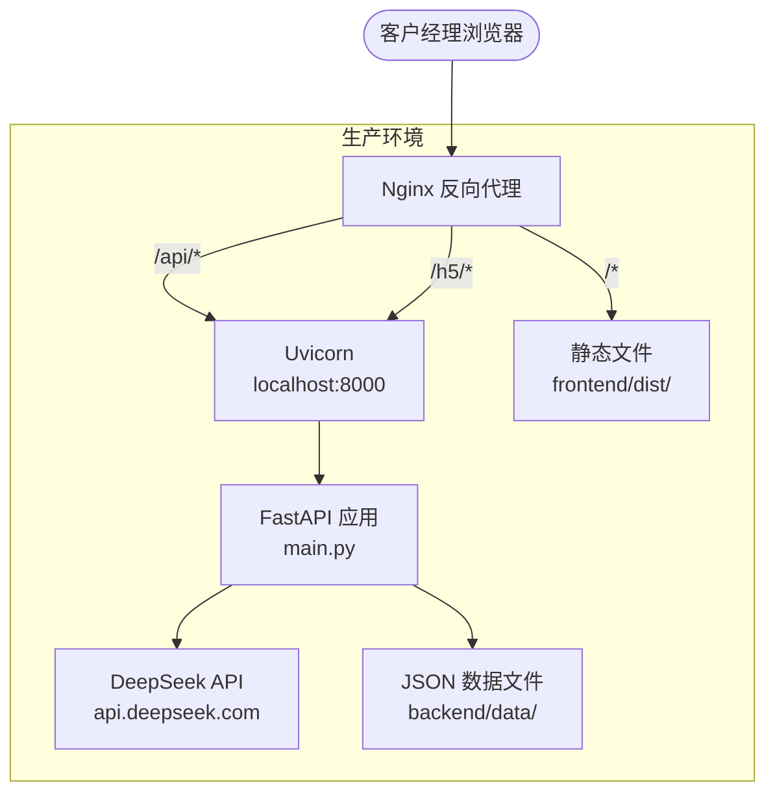

# 07 - 部署与配置

## 7.1 环境变量

### 后端环境变量（backend/.env）

| 变量名 | 必需 | 默认值 | 说明 |
|--------|------|--------|------|
| `DEEPSEEK_API_KEY` | 是 | — | DeepSeek API 密钥（[获取地址](https://platform.deepseek.com/api_keys)） |
| `DEEPSEEK_BASE_URL` | 否 | `https://api.deepseek.com` | DeepSeek API 地址 |
| `PORT` | 否 | `8000` | 后端服务端口 |
| `HOST` | 否 | `localhost` | 后端服务主机（用于生成 H5 URL） |
| `BASE_URL` | 否 | `http://localhost:{PORT}` | 完整基础 URL（用于生成 H5 URL） |
| `MODEL_NAME` | 否 | `deepseek-chat` | Agent 使用的模型名（实际应设为 `deepseek-v4-flash`） |
| `COORDINATOR_MODEL` | 否 | `deepseek-chat` | Coordinator 使用的模型名 |
| `FOLLOW_UP_MODEL` | 否 | `deepseek-chat` | Follow-Up Agent 使用的模型名 |
| `JWT_SECRET` | 否 | 随机生成 | JWT 签名密钥 |

### 前端环境变量

前端无独立环境变量，所有 API 代理通过 `vite.config.ts` 配置。

## 7.2 构建方式

### 开发环境

```bash
# 终端1：启动后端
cd backend
pip install -r requirements.txt
python main.py
# 服务监听 http://0.0.0.0:8000

# 终端2：启动前端
cd frontend
npm install
npm run dev
# 服务监听 http://localhost:3000，/api 代理到 :8000
```

### 生产构建

```bash
cd frontend
npm run build
# 构建产物输出到 frontend/dist/
```

构建后前端为纯静态文件（index.html + JS/CSS 资源），可直接部署到 Nginx 或 CDN。

## 7.3 部署架构



### Nginx 配置示例

```nginx
server {
    listen 80;
    server_name your-domain.com;

    # 前端静态文件
    root /path/to/frontend/dist;
    index index.html;

    # API 代理到后端
    location /api/ {
        proxy_pass http://127.0.0.1:8000;
        proxy_set_header Host $host;
        proxy_set_header X-Real-IP $remote_addr;
        proxy_set_header X-Forwarded-For $proxy_add_x_forwarded_for;
        proxy_set_header X-Forwarded-Proto $scheme;

        # SSE 支持（chat/stream）
        proxy_buffering off;
        proxy_cache off;
        proxy_read_timeout 300s;
    }

    # H5 静态页面代理到后端
    location /h5/ {
        proxy_pass http://127.0.0.1:8000;
    }

    # SPA 路由（所有非文件请求返回 index.html）
    location / {
        try_files $uri $uri/ /index.html;
    }
}
```

## 7.4 Docker 部署

### Dockerfile（后端）

```dockerfile
FROM python:3.11-slim

WORKDIR /app

COPY backend/requirements.txt .
RUN pip install --no-cache-dir -r requirements.txt

COPY backend/ .

EXPOSE 8000

CMD ["uvicorn", "main:app", "--host", "0.0.0.0", "--port", "8000"]
```

### Docker 编排（docker-compose.yml，示意）

```yaml
version: '3.8'
services:
  backend:
    build: .
    ports:
      - "8000:8000"
    env_file:
      - backend/.env
    volumes:
      - ./backend/data:/app/data
      - ./backend/static/uploads:/app/static/uploads

  frontend:
    image: nginx:alpine
    ports:
      - "80:80"
    volumes:
      - ./frontend/dist:/usr/share/nginx/html
      - ./nginx.conf:/etc/nginx/conf.d/default.conf
    depends_on:
      - backend
```

## 7.5 CI/CD

当前项目无自动化 CI/CD 配置（无 `.github/workflows` 等目录）。

## 7.6 外部依赖

### 运行时依赖

| 依赖 | 用途 | 访问方式 |
|------|------|----------|
| DeepSeek API | LLM 调用 | HTTPS（需 API Key） |
| Python 标准库 | 文件操作、加密 | 本地 |

### 网络要求

- 后端服务器需能访问 `api.deepseek.com`（HTTPS 443）
- 浏览器需能访问后端服务（通过 Nginx 反向代理或直连）

## 7.7 数据持久化

### JSON 文件

所有业务数据以 JSON 文件存储于 `backend/data/`，需要注意：

1. **无事务保护**：JSON 写入非原子操作，服务器异常可能造成数据损坏
2. **无并发控制**：`account_opening.json` 等文件的写入使用 `json.dump` 覆盖写，并发写入存在数据竞争
3. **无备份机制**：未自动备份，需手动定期备份 `backend/data/` 目录

### 内存数据

以下数据存储在内存中，重启后丢失：
- 会话消息（`conversations` 字典）
- 上下文记忆（`context_memory` 字典）
- 开户提交通知队列（`account_notifications` 字典）
